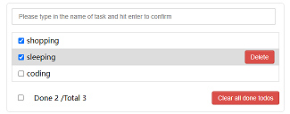

# Introduction to this APP
 This is a todolist APP. You can:
- Add the new todos to the list
- Delete each item after your confirmation
- Show the numbers of finished items and total amount of items. The number can be changed according to the checked status
- Delete all the finished items


# Screenshot


# Bulit with
- HTML
- CSS
- JSX
- React

# Main programming ideas and methods

- Break into different components according to different functional areas of the interface.
- Determine which state of component to store data. If many child components use the data, then put the data in father component.
- Set a "key" when creating lists of elements to identify which item have changed.We often use IDs as keys:
```
     todos.map((todo) => {
                        return < Item key={todo.id} {...todo} />

                    })
```
- If the element that binds the event is exactly the element you will manipulate. There is no need to use "ref". We can use the parameter "event" returned by the callback function:
```
   handleKeyUp = (event) => {
        if (event.keyCode !== 13) return
        if (event.target.value.trim() === "") {
            alert("The input cannot be null")
            return
        }
```

- Transfer data from child component to father component:
    (1) Transfer a function to child component through props
    (2) Child component call this function and transfer data to father component through parameter
    ```
        const todoObj = { id: nanoid(), name: event.target.value, done: false }
        this.props.addTodo(todoObj)
    ```    

- The conditional (ternary) operator and inline css style with react:
    ```
     style={{ display: mouse ? 'block' : 'none' }}
     ```


   